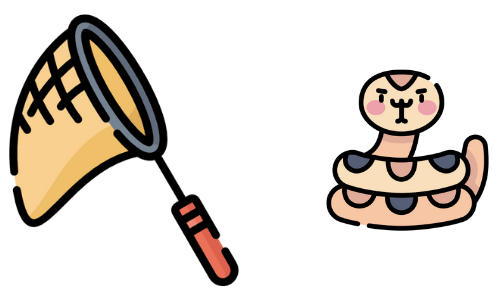

<div id="top"></div>

<!-- PROJECT SHIELDS -->
<!--
*** I'm using markdown "reference style" links for readability.
*** Reference links are enclosed in brackets [ ] instead of parentheses ( ).
*** See the bottom of this document for the declaration of the reference variables
*** for contributors-url, forks-url, etc. This is an optional, concise syntax you may use.
*** https://www.markdownguide.org/basic-syntax/#reference-style-links
-->
[![Contributors][contributors-shield]][contributors-url]
[![Forks][forks-shield]][forks-url]
[![Stargazers][stars-shield]][stars-url]
[![Issues][issues-shield]][issues-url]
[![GPLv3 License][license-shield]][license-url]


<!-- PROJECT LOGO -->
<br />
<div align="center">
  <a href="https://github.com/solamarpreet/CTPy">
    
  </a>

<h3 align="center">Capture The Python</h3>

  <p align="center"><i>
    CTPy is a series of Capture the Flag styled challenges for Python learners
    <br />
  </i></p>
</div>
<br />


<!-- TABLE OF CONTENTS -->
<details>
  <summary>Table of Contents</summary>
  <ol>
    <li>
      <a href="#getting-started">Getting Started</a>
      <ul>
        <li><a href="#prerequisites">Prerequisites</a></li>
        <li><a href="#installation">Installation</a></li>
      </ul>
    </li>
    <li><a href="#usage">Usage</a></li>
    <li><a href="#troubleshooting">Troubleshooting</a></li>
    <li><a href="#roadmap">Roadmap</a></li>
    <li><a href="#contributing">Contributing</a></li>
    <li><a href="#license">License</a></li>
    <li><a href="#contact">Contact</a></li>
    <li><a href="#acknowledgments">Acknowledgments</a></li>
  </ol>
</details>
<br />


<!-- GETTING STARTED -->
## Getting Started

### Prerequisites

The following external dependencies need to be pre-installed in order to host your own server.
* flask
  ```sh
  pip install flask
  ```
<br />

### Installation

1. Clone the repo and cd into the folder
   ```sh
   git clone https://github.com/solamarpreet/CTPy.git && cd CTPy
   ```
2. Start the game server
   ```sh
   python3 server/ctpy-server.py
   ```
3. Open a new terminal and start the Python shell
   ```sh
   python3
   ```
4. Import the ctpy.py file into the Python shell
   ```py
   from ctpy import *
   ```
5. Fetch Question 1 and start playing :)
   ```py
   game.question(1)
   ```
<br />


## Usage

In order to play you need to make use of the '**game**' object that has already been initialized for you. This '**game**' object has 3 methods available which you need to use:
<br />

### game.question()
This method pulls the question text from the server and displays it on the console. It accepts one parameter i.e Question Number
   ```py
   game.question(1)
   ```
<br />

### game.data()
This method fetches the data associated with the Question. It accepts one parameter i.e Question Number
   ```py
   game.data(1)
   ```
<br />

### game.answer()
This method submits your answer to the server and returns a string telling you if your answer was correct or incorrect. It accepts 2 parameters i.e The Question Number you are submitting the answer for and the answer itself.
   ```py
   game.answer(1, 'This is the answer')
   ```
   or
   ```py
   game.answer(1, x)
   ```
   where x is a variable containing the answer.

<br />
<p align="right">(<a href="#top">back to top</a>)</p>


<!-- TROUBLESHOOTING -->
## Troubleshooting

If you get an error stating **'[Errno 111] Connection refused'** then it is possible that Flask started the HTTP server on a non default port.

In that case check the terminal output you get after you run the Step 2 of the <a href="#installation">Installation</a> process. Take a note of the port number and make the change in the last line of ctpy.py file as follows
```nano
# game = Game('http://127.0.0.1:5000')
game = Game('http://127.0.0.1:<your-port-number-here>')
```

If that does not help address your issue check the [open issues](https://github.com/solamarpreet/CTPy/issues) for a list known issues and open a new issue.

<br />

<!-- ROADMAP -->
## Roadmap

- [ ] Dynamic question data to ensure solutions are obtained in a programatic fashion
- [ ] Segregated beginner, intermediate and advanced challenge paths


<br />

<!-- CONTRIBUTING -->
## Contributing

Please contribute additional quality questions/challenges so that Python beginners can continue to benefit from this project.

If you have a question that you wish to add, simply open an issue with the tag "question". You can also fork the repo, add your code and create a pull request.

<br />

<!-- LICENSE -->
## License

Distributed under the GPLv3 License. See `LICENSE` for more information.

<br />

<!-- CONTACT -->
## Contact

Amarpreet Singh - solamarpreet@protonmail.com

Blog & Portfolio : [https://solamarpreet.github.io](https://solamarpreet.github.io)

<br />

<!-- ACKNOWLEDGMENTS -->
## Acknowledgments

* [Python Discord](https://www.pythondiscord.com)
* [Flaticon](https://www.flaticon.com)
* [othneildrew](https://github.com/othneildrew/Best-README-Template)

<br />
<p align="right">(<a href="#top">back to top</a>)</p>


<!-- MARKDOWN LINKS & IMAGES -->
<!-- https://www.markdownguide.org/basic-syntax/#reference-style-links -->
[contributors-shield]: https://img.shields.io/github/contributors/solamarpreet/CTPy.svg?style=for-the-badge
[contributors-url]: https://github.com/solamarpreet/CTPy/graphs/contributors
[forks-shield]: https://img.shields.io/github/forks/solamarpreet/CTPy.svg?style=for-the-badge
[forks-url]: https://github.com/solamarpreet/CTPy/network/members
[stars-shield]: https://img.shields.io/github/stars/solamarpreet/CTPy.svg?style=for-the-badge
[stars-url]: https://github.com/solamarpreet/CTPy/stargazers
[issues-shield]: https://img.shields.io/github/issues/solamarpreet/CTPy.svg?style=for-the-badge
[issues-url]: https://github.com/solamarpreet/CTPy/issues
[license-shield]: https://img.shields.io/github/license/solamarpreet/CTPy.svg?style=for-the-badge
[license-url]: https://github.com/solamarpreet/CTPy/blob/main/LICENSE
